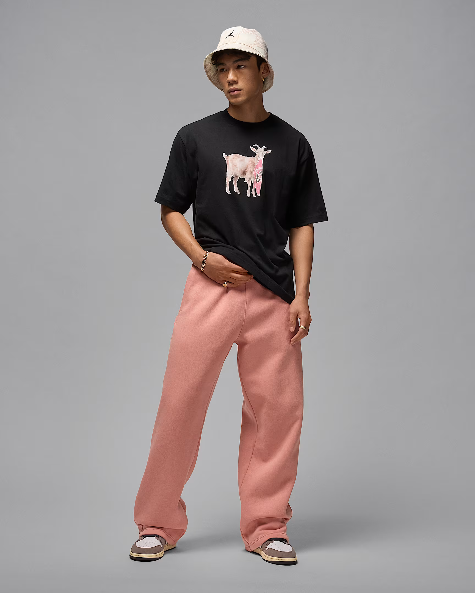
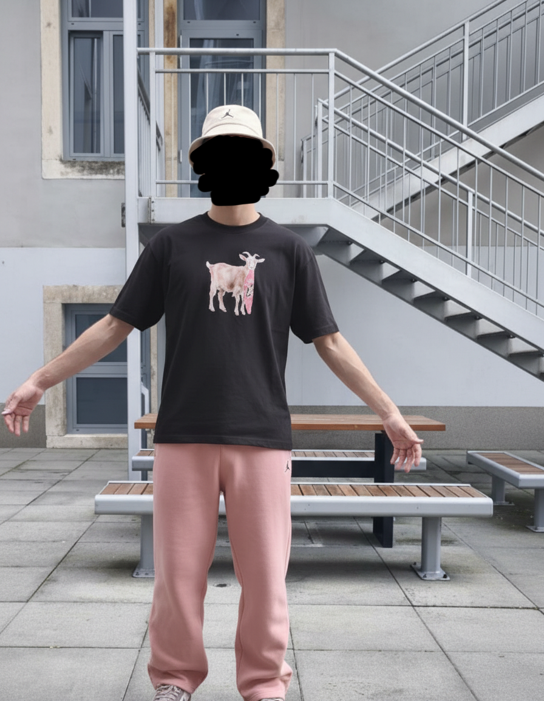
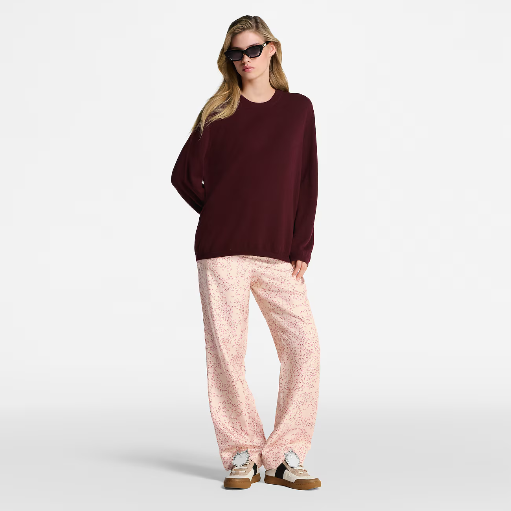

# AI Virtual Try On

> An AI-powered Python script to virtually transfer a complete outfit from a person in one image to another, using the Google Gemini API.

This project provides a simple yet powerful script for creating realistic e-commerce or fashion concept images. It takes a source image of a model and a second image of a person wearing a desired outfit, and generates a new image of the original model wearing that outfit.

---

### Features

-   **Complete Outfit Transfer:** Transfers the entire look (shirt, pants, shoes, etc.) in a single step.
-   **High-Quality Generation:** Leverages Google's `gemini-2.5-flash-image-preview` model (banana 🍌) for cohesive and realistic results.

-   **Simple to Use:** Requires only two input images and a straightforward Python script.

---

### How It Works

The script sends two images and a detailed text prompt to the Google Gemini API:
1.  **Model Image:** The person you want to dress.
2.  **Outfit Image:** A person wearing the clothes you want to transfer.
3.  **Comprehensive Prompt:** A carefully crafted prompt instructs the AI to identify the complete outfit from the second image and redraw it realistically onto the model from the first image.

This single-step process avoids the quality degradation and artifacts that can occur with sequential, multi-step image editing.

---

### Getting Started

#### Prerequisites

-   Python 3.7+
-   A Google AI API Key. You can get one from [Google AI Studio](https://aistudio.google.com/app/apikey).

#### Installation


1. **Install the required Python libraries:**
    ```bash
    pip install google-generativeai pillow
    ```

2. **Set up your API Key:**
    It is strongly recommended to store your API key as an environment variable rather than hardcoding it in the script.

    -   Create a file named `.env` in the project root.
    -   Add your API key to the `.env` file:
        ```
        GOOGLE_API_KEY="YOUR_API_KEY_HERE"
        ```
    - You will need to modify the script slightly to load this key (e.g., using the `os` library).

---

### Usage

1.  Place your model's image in the project directory and name it `model.jpg`.
2.  Place the image of the person wearing the desired outfit in the directory and name it `outfit_image.png`.
3.  Run the script from your terminal:
    ```bash
    python main.py
    ```
4.  The final image will be saved as `model_with_transferred_outfit.png`.

#### Example Flow

`[Image: model.jpg]` + `[Image: outfit_image.png]`  ➡️  `main.py`  ➡️  `[Output Image: model_with_transferred_outfit.png]`

| Before                                                             | After                                                                              |
|--------------------------------------------------------------------|------------------------------------------------------------------------------------|
|   |    |
|  |  |
|  |  |
### License

This project is licensed under the MIT License.